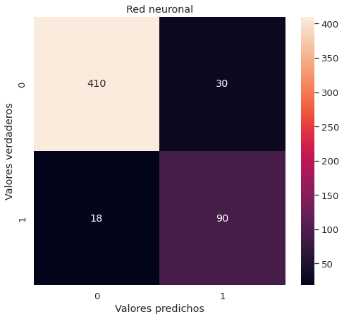

# Problema prediccion pagos creditos
En este desafío su trabajo consiste en implementar un modelo que prediga si un crédito será pagado a tiempo o no.  

1. La clase minoritaria o de interés está representada por 1 (crédito no pagado a tiempo) y la clase mayoritaria por 0 (crédito pagado a tiempo). 
2. Las métricas de evaluación que usará son Gini y F1-score. 
3. El conjunto está desbalanceado. 
4. Las variables discretas que fueron convertidas a columnas, se identifican con una letra diferente (d69 y d70). 
5. Si decide usar regresión logística, tenga en cuenta que para estos problemas suele hacerse un tratamiento previo a los datos usando Weight of Evidence and Binning. Si por el contrario usa algoritmos más complejos, tenga en cuenta que debe indicar conceptualmente, qué haría para dar indicios de cuáles son las variables que tienen más peso en la decisión.

En el conunto de datos para la predicción existen 37 variables continuas o discretas y 6 variables categóricas. En las variables categóricas se realizó previamente un one hot encoding y despues de la transformacion resultaron un total de 71 variables.
Existe un conjunto de datos de entrenamiento y otro de test para el desarrollo del modelo

## Observaciones
- La variable 34 y 36 es la misma en casi todas las instancias (solo en 5 instancias son distintas), por lo que una es redundante y se elimina del dataset
- Las variable v21 y v22, estan directamente relacionadas con v30, v21 + v22 = v30, por lo que una variable es redundante y se debe eliminar.
- Las variable v16 y v29, estan relacionadas ya que la variable v29 solo toma valores de 0 ó 100. Cuando toma valores de 0, la variable v16 tambien es 0, mientras que cuando toma el valor 100 la variable v16 es diferente de 0.
- Las variables 37 en delante son 5 variables categoricas que fueron codificadaas con 'one hot'.
- La variable d70 son solo ceros, por lo que no brinda informacion y se puede eliminar del dataset
- Algunas variables categóricas tienen muy pocas instancias por lo que se pueden juntar con otras de la misma clasificacion para quitar algunas variables innecesarias.

## Preprocesamiento de variables
### Escalamiento de variables

Variables distintas generalmente no estan en la misma escala, algunas pueden ser muy grandes o muy pequeñas comparadas con otras. Esto puede resultar en un problema al entrenar los modelos ya que las variables a mayor escala acapararan mas la atencion del modelo debido a su magnitud, a pesar de que pueden no ser realmente significativas para la prediccion.
Para evitar esto, las variables se transforman a una misma escala y existen distintos métodos para esto. Algunas opciones son las siguientes

- Estandarización

Convierte los datos a una distribucion normal con un promedio de  y una desviacion estandar de 

- Escalamiento unitario

Escala los datos y los encapsula en valores entre 0 y 1 con la siguiente forma

Despues de algunas iteraciones para este problema en especifico, resultó que la operación de estandarizacion tuvo un mejor rendimiento que la de escalamiento unitario por lo que se utilizará dicho algoritmo.

### Reduccion de numero de variables utilizando PCA (opcional)

PCA (Analisis de componentes principales), es una técnica para reducir el numero de variables del problema. Al reducir el número de dimensiones del problema el tiempo de convergencia del algoritmo puede reducir drasticamente, aunque esto puede llegar a reducir la precisión del algoritmo debido a los datos que se pierden. El 'trade-off' entre precision y tiempo de convergencia del algoritmo es lo que debe tomar en cuenta el usuario al utilizar esta técnica de preprocesmiento.

En este código se utiliza un PCA con un 95%, es decir se reduce la dimensionalidad conservando un 95% de la varianza de los datos del problema original.

## Modelos

Una red neuronal multicapa (MLP-NN) de clasificacion fue utilizada para la solución de este problema

Despues de varias iteraciones con distintas configuraciones para la red neuronal se utilizó una con 3 capas escondidas, la primera con 14 nodos, la segunda con 5 nodos y la última con 2. La funcion de activacion utilizada en las capas escondidas fue la ReLU (Rectified Linear Unit). un learning rate constante con valor de 0.001.

Tambien se utilizó un random forest para clasificacion, utilizando el criterio de Gini y dandole un valor mayor a la clase minoritaria (1) para la clasificacion.

Los modelos fueron construidos utilizando la libreria [ScikitLearn](https://scikit-learn.org/stable/index.html)

### Evaluacion del modelo

Para evaluar la capacidad de predicción del modelo se realiza una prueba del modelo entrenado en un conjunto de datos independiente, el cual el modelo no 'vio' al entrenarse.
Las métricas de evaluacion tanto para el modelo de red neuronal como el de random forest, se utilizaron las fórmulas de precision y exhaustividad asi como la metrica de F que es una combinacion de ambas métricas, las métricas se definen de la siguiente manera

Donde vp significa verdaderos positivos, fp falsos positivos (casos que son negativos pero fueron predichos como positivos) y fn falsos negativos (casos que eran positivos pero fueron clasificados como negativos).

## Resultados
A continuacion se muestran las matrices de confusion de ambos modelos

Debido a que estamos analizando un sistema de pagos de crédito, los casos positivos en los que el cliente o empresa no pagó tienen una mayor importancia para los inversionistas, por lo que para este problema la exhaustividad es mas importante que la precisión. Es por eso que se decidió utilizar una beta mayor a 1 para darle mas importancia a la exhaustividad.

Para random forest
La precision en los datos de prueba es: 0.7712
El recall en los datos de prueba es: 0.8426
El F1 en los datos de prueba es: 0.8193

Para red neuronal
La precision en los datos de prueba es: 0.75
El recall en los datos de prueba es: 0.8333
El F1 en los datos de prueba es: 0.8058

## Conclusion

El modelo de random forest arrojó un F con un valor de 0.82, lo cual indica que el modelo utilizado tiene una alta capacidad de predecir de manera correcta si un cliente va a pagar o no el crédito que se le dió.

